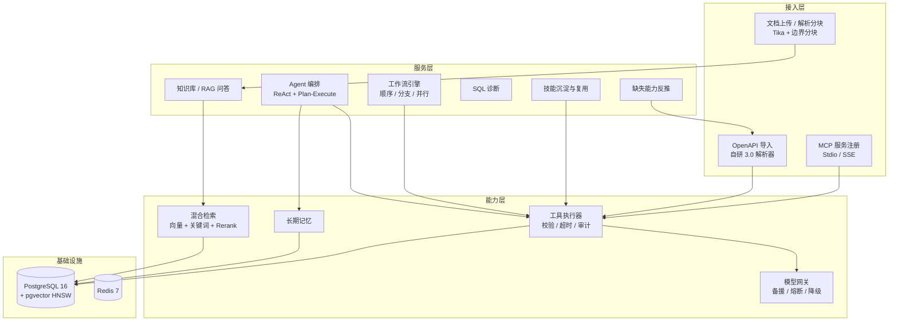
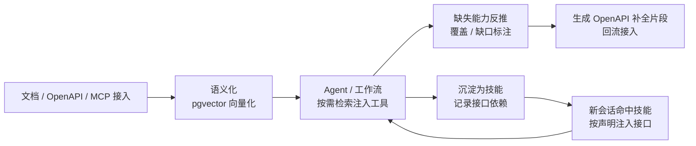

# DevMind

[](https://github.com/StartOver000/DevMind/actions/workflows/ci.yml)

**面向研发团队的通用 AI 接入层平台** —— 把文档、接口（OpenAPI）、MCP 服务统一「语义化」接入 AI：Agent 对话与工作流按需发现并调用工具，缺失能力自动反推补全，沉淀为可跨会话复用的技能。

> 核心思想：**接入即能力**。不为每个系统单独写 AI 集成 —— 上传文档 / 登记接口 / 注册 MCP 后，即可被 AI 检索、调用与复用。

## 核心能力

| 能力 | 说明 |
| --- | --- |
| 知识库与 RAG 问答 | 文档上传解析（Tika）→ 分块 → 向量入库；混合检索（向量 0.7 + 关键词 0.3）+ 查询路由 + 双模式 Rerank（可回退）；多轮会话、引用溯源、版本对比回滚 |
| Agent 编排 | ReAct + Plan-Execute 双模式，工具调用校验/超时/审计，长期记忆（记忆提取 + CRUD） |
| 接口工具化 | **自研 OpenAPI 3.0 解析器**（Jackson + SnakeYAML）批量导入接口 → pgvector 语义档案 → 自然语言检索命中 → 对话/工作流按需注入（超 20 个注入 top 8） |
| 缺失能力反推 | 自然语言需求 → LLM 拆解 → 语义检索标注覆盖/缺口 → 生成 OpenAPI 补全片段回流接入 |
| 工作流引擎 | 自然语言生成工作流（顺序/条件分支/并行组 + 变量传递）；**同工作流并发触发排队串行**（per-workflow 闸门）而非拒绝 |
| 技能沉淀复用 | 工作流沉淀为技能时自动记录接口依赖 → 新会话命中技能按声明注入接口（不依赖语义检索，稳定可复现） |
| SQL 诊断 | EXPLAIN 解析 + 规则初筛 + AI 建议（失败回退规则），支持 mock 模式 |
| 模型韧性治理 | 多级备援（智谱→SiliconFlow→OpenRouter）、429 分级熔断 60s、超时快失败（5s/15s）、错误分类按 HTTP 状态码、本地 RAG 兜底、Embedding 两级缓存（内存 + 表） |
| 平台治理 | 多租户团队隔离、登录/安全加固（可关）、用量配额、审计日志、50 条检索评估管线（MRR/Recall@K/NDCG）、Prometheus 监控 |

## 系统架构



## 能力闭环（接口智能化的完整链路）



## 快速开始

**一键演示**（起 PostgreSQL → 构建 → 启动 mock 服务 → 幂等导入演示数据 → 打印演示清单）：

```powershell
# Windows
powershell -ExecutionPolicy Bypass -File scripts/demo/demo.ps1

# Linux / macOS
./scripts/demo/demo.sh
```

演示数据快照包含 5 个知识库 / 46 篇文档 / 851 个切片 / 27 个接口工具 / 14 个工作流 / 4 个技能，开箱即用；`-Reset` 可重置重导。

**传统方式**（默认免登录，`DEVMIND_AUTH_ENABLED=false`）：

```bash
docker compose up -d
mvn spring-boot:run
```

**没有模型 API Key**：内置模拟模型跑通全链路（确定性伪向量，可演示语义检索命中）：

```bash
docker compose up -d
mvn spring-boot:run -Dspring-boot.run.profiles=mock
```

## 模型配置

默认使用 OpenAI-compatible API（DeepSeek / 通义 / 智谱 / Ollama 均可用），环境变量注入：

```bash
OPENAI_API_KEY=sk-xxx
OPENAI_BASE_URL=https://api.openai.com
OPENAI_CHAT_MODEL=gpt-4o-mini
OPENAI_EMBEDDING_MODEL=text-embedding-3-small
DEVMIND_EMBEDDING_DIMENSIONS=1536
```

## 核心接口

```text
# 知识库与文档
POST/GET/DELETE  /api/knowledge-bases
POST            /api/knowledge-bases/{kbId}/documents   # 上传解析
POST            /api/knowledge-bases/{kbId}/search      # 纯语义检索（不调 LLM）
POST            /api/knowledge-bases/{kbId}/chat        # RAG 问答

# Agent / 工作流 / 技能
POST            /api/agent/chat                          # Agent 对话（工具调用 + 记忆）
POST            /api/workflows/{id}/run                  # 执行工作流
POST            /api/workflows/generate                  # 自然语言生成工作流
POST            /api/skills                              # 工作流沉淀为技能

# 接口工具化
POST            /api/tools/import-openapi                # OpenAPI 批量导入
POST            /api/capabilities/analyze                # 缺失能力反推

# 诊断 / 评估 / 平台
POST            /api/sql-diagnosis                       # SQL 执行计划诊断
GET             /api/evaluations/retrieval               # 检索评估（50 条样本）
GET             /api/model-usage                         # 模型用量
GET             /api/audit-logs                          # 审计日志
POST            /api/auth/login                          # 登录
```

## 架构决策（主动取舍）

| 决策 | 理由 |
| --- | --- |
| **JdbcTemplate 直用，不引 ORM** | pgvector 向量检索需要精确控制 SQL（`<=>` 距离、HNSW、jsonb 过滤）；JdbcTemplate 可读可控，避免 ORM 对向量类型的阻抗 |
| **启动幂等建表，不用 Flyway** | 单机作品数据量小、表结构演进靠 ALTER 幂等，刻意不引入迁移框架；若演进到多实例会补 Flyway |
| **限流 120/min/路径/用户** | 防刷设计（防 AI 工具被无限调用产生费用）；压测时显式调高排除干扰 |
| **同工作流并发排队串行** | 并发触发从「拒绝」改「排队」（per-workflow 闸门 + 上限/超时兜底）；不同工作流互不影响 |
| **单实例，不用 Nacos/注册中心** | 演示与单机场景无多实例需求；模型多级备援已在网关层解决可用性 |

## 质量证据

- **CI**：GitHub Actions 全绿，~2min（并行 + 依赖缓存 + 跳过冗余步骤）
- **测试**：后端 **377** 单测/集成（含越权/注入/模型降级/并发排队/Agent 组件）+ 前端 40 vitest + Playwright E2E
- **压测基线**（mock，16 并发，100% 成功）：

| 场景 | QPS | P50 | 说明 |
| --- | --- | --- | --- |
| 纯语义检索 `/search` | **183.1** | 86ms | 已含 L1 内存缓存 + 连接池 20 优化；热请求 ~18ms |
| 工作流编排 `/workflows/{id}/run` | **208.0** | 21.5ms | 并发触发排队串行，多工作流并行 |
| CRUD 读 `/tools` | **1885** | 7.7ms | 含鉴权/限流/审计全链路 |

- **检索评估**：50 条样本离线评估管线（MRR / Recall@K / NDCG），检索质量回退 >5% 自动告警

## 技术栈

JDK 17 编译 / 21 运行 · Spring Boot 3.3.13 · Spring AI 1.0.0 · PostgreSQL 16 + pgvector · Redis 7 · Apache Tika · JdbcTemplate · Vue 3 + Vite

## 文档导航

- [项目说明（小白版）](docs/guide-01-项目说明-小白版.md) · [如何运行](docs/guide-02-如何运行.md) · [接口使用手册](docs/guide-03-接口使用手册.md)
- [项目结构和代码说明](docs/guide-04-项目结构和代码说明.md) · [数据库设计](docs/guide-05-数据库设计.md)
- [AI 概念白话解释](docs/guide-06-AI概念白话解释.md) · [一键部署说明](docs/guide-09-一键部署说明.md) · [生产部署与运维](docs/guide-14-生产部署运维.md)
- [真实模型联调报告](docs/guide-12-真实模型联调报告.md) · [检索评估报告](docs/guide-10-检索评估报告.md) · [检索链路深度优化](docs/guide-30-检索链路深度优化.md)
- 原始设计：[总体架构设计](docs/01-总体架构设计.md) · [数据库与向量模型](docs/02-数据库与向量模型.md) · [MVP 接口契约](docs/03-MVP接口契约.md) · [分阶段实施计划](docs/04-分阶段实施计划.md)
